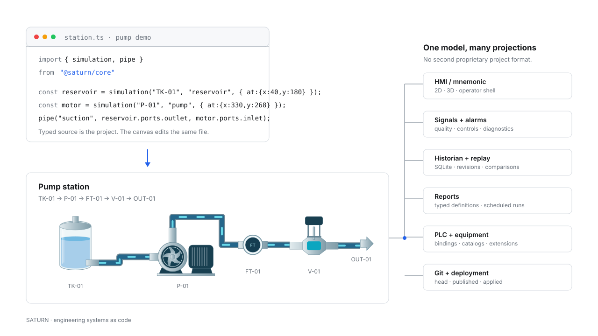

# Saturn

**Engineering systems as code.**

Saturn is an open-source engineering IDE and runtime for physical systems. Describe equipment, topology, signals, controls, HMI, history, alarms and reports as a typed TypeScript project — then use that same model in engineering, operation and deployment.



[Open browser editor](https://pom4h.github.io/saturn/) · [DSL reference](docs/plant/dsl.md) · [Architecture](docs/adr/0001-saturn-system-architecture.md) · [Developer guide](docs/developer/language-tooling.md)

## The project is the model

A traditional automation project tends to split one physical installation across PLC configuration, tag databases, HMI screens, historian setup, reports, deployment scripts and documentation.

Saturn keeps the engineering model in ordinary source files.

```ts
import {
  system,
  simulation,
  pipe,
  port,
} from '@saturn/core'

export const water = system('water', 'Water system')

export const tank = simulation('T-101', 'reservoir', {
  system: 'water',
  at: { x: 80, y: 180 },
})

export const pump = simulation('P-101', 'pump', {
  system: 'water',
  at: { x: 360, y: 180 },
})

export const suction = pipe(
  'suction',
  port(tank, 'outlet'),
  port(pump, 'inlet'),
)
```

The TypeScript source is not an export format generated after the fact. It is the authored project.

Saturn uses TypeScript for the things engineers already expect from serious software tooling: types, autocomplete, navigation, refactoring, diagnostics and source control. The Saturn compiler then adds domain rules for equipment, signals, topology, controls and deployment.

Projects use a bounded declarative subset. Saturn does not execute arbitrary project JavaScript.

## One model, multiple projections

The same stable equipment IDs and bindings drive:

- **engineering views** — source, project tree, catalog, 2D/3D mnemonic and properties;
- **operator HMI** — live state, controls, alarms and navigation;
- **runtime** — signals, simulation or adapters, historian and replay;
- **reports** — project-defined queries, tables and charts over recorded data;
- **PLC and equipment integration** — controller definitions, ports, wiring and target providers;
- **delivery** — Git revisions, validation, release state and standalone deployment.

A renderer does not own another project model. A report does not invent another tag namespace. The VS Code host does not embed a second Saturn IDE. They are views over the same project and runtime contracts.

## Visual editing without a hidden project format

The canvas is another editor for the source.

```text
drag P-101
    ↓
change x / y in TypeScript
    ↓
normal Git diff
```

Source-preserving edits keep comments and unrelated code intact. Invalid source keeps the last valid view visible instead of reconstructing the project from SVG or JSON.

This also means coding agents and human engineers work on the same artifact.

## Configuration and live state are different things

Saturn deliberately separates Git from operational state.

```text
project source
     │
     ▼
   head ──────► published ──────► applied
     │                              │
     │                              ▼
     │                         live runtime
     │                    signals · history
     │                    alarms · commands
     ▼
normal Git workflow
```

Git is the configuration and release authority. The running Saturn instance is the authority for telemetry, history and operator commands.

An engineering Saturn can connect to an operator Saturn while keeping local source and Git local. The UI shows source and applied revisions independently instead of pretending they are always the same commit.

See [Standalone Saturn](docs/standalone.md) and [ADR-0001](docs/adr/0001-saturn-system-architecture.md).

## Use Saturn where you engineer

Saturn is one application; projects stay ordinary directories.

```sh
saturn open ./pump-station
saturn run ./pump-station
saturn run ./pump-station --kiosk
```

The standalone application is built once and opens projects at runtime. Portable Windows, Linux and macOS binaries plus SHA-256 checksums are attached to GitHub Releases; the same targets can be built locally with the pack workflow.

The same project can also be used from the browser/PWA and from the native VS Code host. VS Code keeps TypeScript in the normal editor, Git in native SCM, diagnostics in Problems, project/catalog/targets in TreeViews and the mnemonic as a separate visual view.

## Extend the domain instead of forking the IDE

Equipment catalogs and integration logic are extension points.

```sh
saturn extension add @factory/equipment
saturn extension update @factory/equipment
```

Installed packages can contribute engineering entities and tooling without creating a second project format. First-party examples use the `@saturn/*` namespace; external vendors can use normal npm-compatible package scopes.

The extension installer verifies package integrity, runs no lifecycle scripts and keeps project source separate from application code.

See [extension architecture](docs/adr/0002-extension-packages.md).

## Reports belong to the engineering model too

Reports are declared alongside signals and history policy rather than implemented as one-off application pages.

```ts
export const flowHour = report('flow-hour', {
  title: 'Flow history',
  signals: ['P-101.flow'],
  window: 3_600_000,
  sql: `SELECT signal, AVG(value) AS average
        FROM samples
        WHERE quality = 'good'
        GROUP BY signal`,
  columns: [
    { key: 'signal', title: 'Signal' },
    { key: 'average', title: 'Average' },
  ],
})
```

The runtime exposes bounded read-only history tables to report capsules. Reports can produce tables and SVG charts and can run manually or on a schedule.

See [report DSL](docs/plant/dsl.md#reports).

## What is implemented

The current codebase includes the typed `@saturn/core` DSL, AST validation, source-preserving visual edits, CodeMirror engineering shell, 2D/3D views, equipment catalog metadata, alarms, controls, historian, replay/comparison, project-defined reports, Git-backed project/release workflow, standalone packaging, extensions, a signed update protocol and a native VS Code host.

The repository also contains simulation models used for development and demonstrations. They are intentionally bounded engineering models, not validated process solvers.

## Safety and scope

Saturn is engineering software under active development. The included demonstration models are not safety models, certified control logic or substitutes for equipment-specific engineering calculations.

Real equipment control must pass through explicit adapters/providers with authentication, validation and capability boundaries. A visualization, simulator or report must never silently become a safety authority.

## Develop Saturn

Node.js 24 is used for the repository toolchain. Bun is used for standalone packaging.

```sh
npm ci
npm run check
npm run dev
```

Run the installation workbench:

```sh
npm run plant
```

Build a standalone application:

```sh
npm run saturn -- pack --target windows-x64
```

Useful documentation:

- [Saturn system architecture](docs/adr/0001-saturn-system-architecture.md)
- [Package and DSL names](docs/adr/0004-package-and-dsl-names.md)
- [TypeScript DSL and language tooling](docs/developer/language-tooling.md)
- [Standalone application](docs/standalone.md)
- [Installation, historian and report DSL](docs/plant/dsl.md)
- [VS Code host](docs/adr/0005-vscode-host.md)
- [Contributing](CONTRIBUTING.md)
- [Security](SECURITY.md)

## License

MIT © Roman Popov.
