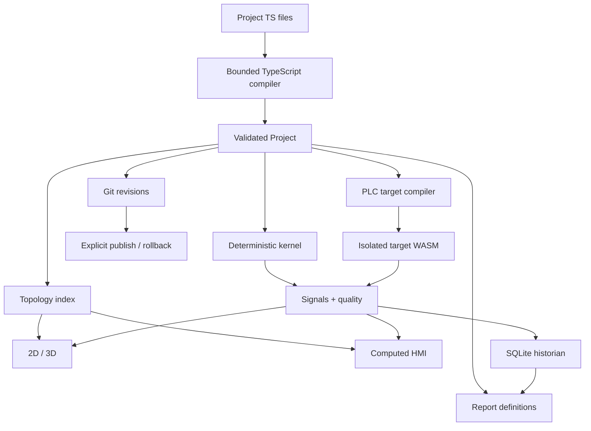

# Saturn architecture

Saturn is built around one rule:

> **Authored engineering intent has one source of truth; every visual/runtime surface is a projection or observation of it.**

This avoids maintaining a separate HMI project, report layout database, deployment archive and simulation configuration for the same installation.

## Layers



## 1. Project compiler

Project source is not executed as JavaScript.

`plant/compiler.ts` parses TypeScript AST and accepts an allow-listed declarative subset:

- named imports;
- initialized `const` declarations;
- literals, arrays and objects;
- simple scalar arithmetic;
- installed Saturn DSL calls.

Loops, dynamic imports, functions, prototype access and arbitrary calls are rejected. Validation budgets bound file count, source size, expression depth and project cardinality.

The compiler produces `Project`, the stable internal contract used by all downstream layers.

## 2. Topology

Systems, devices, controllers, ports and physical connections form one identity graph.

2D and 3D do not maintain independent equipment records. A terminal has one semantic identity and target coordinates for each renderer. Selection, signals and routes refer to equipment/terminal IDs.

Routing caches are disposable derived data.

## 3. Computed HMI

`deriveHmi(project)` is a pure projection.

The implementation indexes the topology once, then creates a bounded screen graph. The shell caches this projection for the lifetime of a compiled Project object. Live frames update values and animation only; they do not rebuild the screen hierarchy.

This distinction matters for large installations:

```text
project changed  -> rebuild HMI graph
telemetry changed -> update bound values only
```

Manual presentation DSL can override or augment the generated interface. It is not required for basic navigation.

## 4. Presentation model

HMI and reports share `ViewNode`:

- groups;
- text;
- values;
- tables;
- charts;
- actions;
- navigation;
- signal-driven motion.

Bindings are separate from layout. A report evaluates bindings only from its frozen data capsule; live HMI evaluates them from the current frame.

Target capability is explicit. Web HMI can render richer widgets; PLC LCD compilation accepts only nodes supported by that target and fails on unsupported nodes.

## 5. Deterministic runtime

The kernel advances installed models on a fixed model clock. A frame read is observation-only.

Runtime input, project revision, model versions and controller state are checkpointed explicitly. UI rendering, number of connected browsers and switching between 2D/3D/HMI must not advance simulation time.

## 6. PLC target

Saturn vendors a pinned portable Firmverse Saturn package.

The shared compiler owns `.fbdbin` serialization. Each simulated PLC executes in an isolated WASM instance. Stateful block memory is saved through a versioned state ABI tied to the exact program/runtime.

The MVP does not claim arbitrary PLC firmware compatibility or real-device flashing.

## 7. Historian

History is stored separately from project source.

Each archived signal has:

- deadband;
- maximum confirmation interval;
- retention.

Quality transitions are always significant. Reports can query isolated copies of declared `samples` and `segments`; they never receive access to authentication tables or the operational database.

## 8. Git releases

Git is Saturn's release store, not its historian.

A running installation has an immutable project revision. Publication changes the desired revision explicitly. Old report artifacts, events and runtime runs retain the revision they were created from.

This makes rollback a source/release operation rather than destructive mutation of history.

## 9. Adapters

Shared logic avoids Node/DOM APIs.

Adapters provide:

- native SQLite vs SQLite WASM/OPFS;
- native Git vs browser local revision emulation;
- Node HTTP/auth/SSE vs browser Worker;
- Web Push vs local browser notification;
- web canvas vs procedural 3D renderer.

## Performance rules

Saturn prefers derived caches over additional persisted models.

Current rules:

- compiled Project changes invalidate Auto HMI; live frames do not;
- TypeScript ASTs used for visual source links are cached until a file's source changes;
- topology indexes are built once per HMI derivation instead of repeated linear scans;
- visual telemetry patches values/animation without rebuilding the full presentation DOM;
- 3D code is lazy-loaded;
- route geometry recalculates only when topology/placement changes;
- historian deadband reduces write volume without changing live semantics.

## Trust boundaries

Trusted installed code:

- Saturn runtime;
- model catalog;
- renderers;
- target compilers.

Untrusted/authored project input:

- bounded DSL files;
- report SQL against isolated capsules;
- operator values constrained by declared controls.

The project compiler does not turn source into arbitrary executable application code.

## MVP boundary

The architecture is suitable for an open engineering SCADA MVP. It is not a safety certification argument. Site-specific redundancy, safety lifecycle evidence, deterministic fieldbus timing, HA and cybersecurity qualification remain deployment/product work beyond the current MVP.
